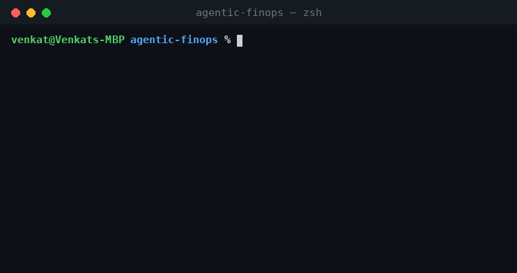

# agentic-finops

**An MCP-driven right-sizing agent for GKE workloads.** It reads a day of
Prometheus metrics per workload, right-sizes CPU/memory requests and limits
against the observed signal *and* the Goldilocks/VPA recommendation, and — for
JVM apps — accounts for startup spikes, heap, and threads so a cost cut never
turns into a 3 a.m. OOM.

<p>
  
  
  
</p>




> A generalized, open version of a system I run in production, where agentic
> FinOps drove **$1.3M+ in annualized savings** across 16 GCP projects. The
> proprietary bits are stripped; the approach — and the reasoning that keeps it
> safe — is here in full and runnable.

**Why split it into a skill and an engine?** A thin Claude **skill**
([`SKILL.md`](SKILL.md)) does the orchestration — locate the export, run the
scan, split cost from reliability, route to Slack or a PR. The number-crunching
lives in a Python **engine** (`src/agentic_finops/`). That way the model reasons
about the *judgment calls*, not about thousands of raw metric rows one at a time,
which is faster, cheaper, and deterministic. It's the "thin orchestration, heavy
compute in direct-API Python" pattern, made concrete.

---

## The problem

Most Kubernetes cost waste is over-provisioned **requests** — CPU and memory
that a pod reserves on a node and never uses. Reclaiming it improves
bin-packing and removes nodes. Easy money... except right-sizing is exactly
how teams cause outages:

- Cut CPU **limit** too far and the app is **throttled** — latency dies while
  average CPU still looks fine.
- Cut memory to the average and you **OOM-kill** at the next traffic peak,
  because memory is non-compressible.
- Size a **JVM** to its steady state and it **can't start** — the JIT and class
  loading spike CPU and memory hard during warm-up.
- Set `-Xmx` without headroom for non-heap and the container OOMs at the worst
  possible moment.

So this engine treats right-sizing as a reliability problem that happens to
save money. Detection is deterministic and conservative; the LLM agent
orchestrates (scan → summarize → route to review) and never does the math.

## What it checks

**Cost — reclaim over-provisioned requests**

- CPU request vs. steady-state **p95** (startup excluded) and the
  **Goldilocks/VPA** target
- Memory request vs. **working-set peak** — sized to peak, never average

**Reliability — fix before (or instead of) cutting**

- **CPU throttling** via `container_cpu_cfs_throttled_periods`
- **Startup CPU** — limit must clear the JVM warm-up peak or boots flake
- **OOM risk** — memory limit vs. peak and observed OOM-kills
- **JVM heap** — container limit must clear `-Xmx` + non-heap + overhead
- **Thread pressure** — live threads vs. pool/ulimit ceiling
- **Under-provisioning** — usage at/over request (raise, don't cut)

## Quickstart

Runs offline against the bundled sample export — no cluster needed.

```bash
git clone https://github.com/venkat-mandadi/agentic-finops
cd agentic-finops
pip install -e ".[dev]"

python examples/run_analysis.py
# or:
finops-scan examples/sample_workloads.csv --format markdown
finops-scan examples/sample_workloads.csv --category reliability
```

### Sample output

```
GKE right-sizing: 15 findings — $430/mo ($5,165/yr) reclaimable, 9 reliability risk(s)
==============================================================================
COST — reclaim over-provisioned requests
------------------------------------------------------------------------------
[HIGH  ] data-prod/batch-processor    $    256/mo  cpu request 2000m -> 400m  (×10 replicas)
[MEDIUM] legacy-prod/legacy-monolith  $     71/mo  cpu request 2000m -> 520m  (×3 replicas)
[MEDIUM] data-prod/batch-processor    $     58/mo  mem request 4096Mi -> 1264Mi (×10 replicas)
[LOW   ] payments-prod/payments-api   $     42/mo  cpu request 1000m -> 350m  (×4 replicas)

RELIABILITY — fix before (or instead of) cutting
------------------------------------------------------------------------------
[HIGH  ] catalog-prod/catalog-worker  cpu_limit    cpu limit 500m is throttling 35% of periods
[HIGH  ] payments-prod/checkout-svc   mem_limit    mem limit 1024Mi too tight
[HIGH  ] payments-prod/checkout-svc   jvm          -Xmx 900Mi + non-heap 260Mi + overhead > mem limit 1024Mi
[MEDIUM] legacy-prod/legacy-monolith  cpu_limit    startup peak 2600m exceeds cpu limit 2000m
[MEDIUM] notify-prod/notifications    threads      threads peak 470 vs ceiling 512
```

Notice `legacy-monolith`: its CPU **request** is safely cut 2000m → 520m, but
the engine simultaneously flags that its CPU **limit** must stay above the
2600m startup peak. Cost and safety in the same pass.

## Running it as an agent

**As a Claude skill.** Drop the folder into your skills directory (or install
the packaged `.skill`). The skill triggers on right-sizing / GKE-cost / OOM /
throttling requests, runs `scripts/finops_scan.py` under the hood, and presents
the ranked result — reliability risks first, then cost wins. It deliberately
*never* pulls raw metrics into the model's context; the engine does the math and
returns a compact report. See [`SKILL.md`](SKILL.md).

**As an MCP tool** for an interactive agent:

```bash
pip install -e ".[mcp]"
python -m agentic_finops.mcp_server examples/sample_workloads.csv
```

Tools: `scan_workloads()`, `get_recommendations(category, min_monthly_savings)`,
`rightsizing_report(fmt)`. A typical agent flow: *scan → post the savings +
risks to Slack → open a PR that patches requests/limits, with each finding's
rationale attached.*

## Architecture

Detection is pure and testable; the agent surface (MCP) is a thin adapter.
Full diagram and design notes in [`docs/architecture.md`](docs/architecture.md).

```
Prometheus (1d) ─┐
pod spec         ├─▶ metrics loader ─▶ Workload ─▶ rules ─▶ recommender ─▶ report
Goldilocks/VPA  ─┘                    (startup     (pure,      (savings +
                                       excluded)    tested)     ranking)   └─▶ MCP ─▶ Claude ─▶ Slack / PR
```

## Design decisions

- **p95, startup excluded.** Steady-state CPU uses p95 with the warm-up window
  filtered out; averages hide bursts and startup inflates everything.
- **Memory is sized to peak, and the peak includes startup.** Non-compressible
  memory sized to the average is an OOM waiting for traffic.
- **The JVM sets a floor.** A memory recommendation is never below
  `-Xmx + non-heap + overhead`, no matter what VPA says.
- **Requests and limits are different decisions.** A pod's CPU request can drop
  while its limit stays high to survive startup — the engine treats them
  separately.
- **Cost and reliability are separated in the output.** A right-sizing report
  that buries the "this will OOM" items is worse than none.
- **Every finding is auditable.** Because an agent proposes these into a human
  review, each one states the exact metric and threshold it tripped.

## Wiring up real data

Swap `metrics.load_from_csv` for `load_from_prometheus` (the real PromQL shapes
are in `metrics.PROMQL`): query Prometheus over your window, join with the live
pod spec and the Goldilocks/VPA object, map into the `Workload` schema in
[`examples/sample_workloads.csv`](examples/sample_workloads.csv), and the rest
of the pipeline is unchanged.

## Roadmap

- [ ] Live Prometheus + VPA loader (drop-in for the CSV)
- [ ] Emit recommendations as a reviewable PR patch (requests/limits diff)
- [ ] HPA-aware CPU sizing (don't fight the autoscaler's target)
- [ ] Node bin-packing simulation to turn reclaimed requests into node counts
- [ ] GPU / accelerator right-sizing — the next spend frontier

## Tests

```bash
pytest -q      # detection rules + savings math + report rendering
```

## License

MIT — see [LICENSE](LICENSE).
