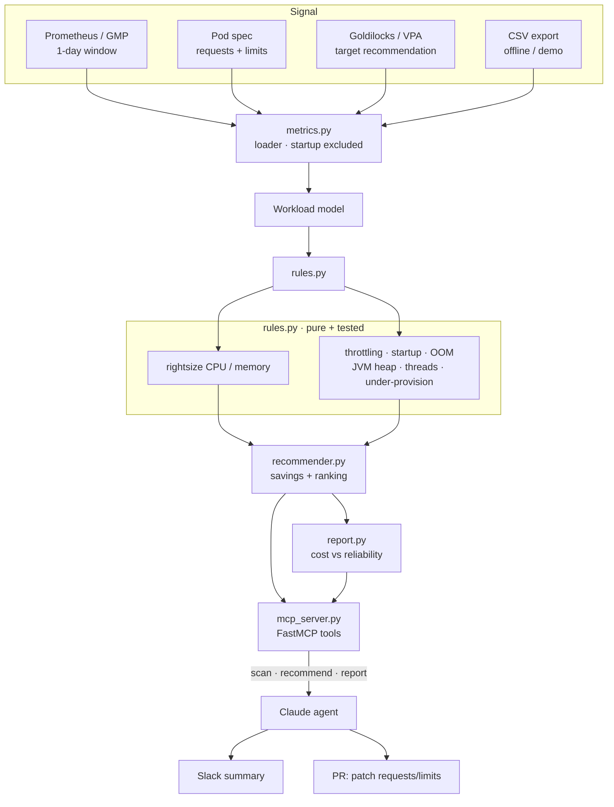

# Architecture

`agentic-finops` is layered so the **decision logic** stays pure and testable
and the **agent surface** (MCP) is a thin adapter on top. An LLM never sees raw
metrics — it calls typed tools that return costed, explained, ranked
recommendations.

## Why this shape

**The agent orchestrates; it never does the math.** `rules.py` and
`recommender.py` have zero dependency on `mcp` or any LLM, so the risky part —
deciding what to cut — is ordinary, deterministic, unit-tested code. The agent
scans, summarizes, and routes to a human review.

**Startup is a first-class concept.** JVM warm-up spikes CPU and memory. The
loader excludes the startup window from steady-state metrics, but keeps the
startup peaks so the recommender can floor memory and protect the CPU limit
against them. This is the difference between a right-sizing tool that works in a
demo and one that survives a rollout.

**Requests and limits are decided separately.** Requests drive scheduling and
cost; limits drive throttling and OOM. Collapsing them is how right-sizing
causes incidents, so the engine keeps them distinct — a workload can be a CPU
*request* downsize and a CPU *limit* raise at the same time.

**Every recommendation carries its rationale.** Because an agent proposes these
into a change review, "the model said so" is not an acceptable audit trail —
each finding names the metric and threshold behind it.
